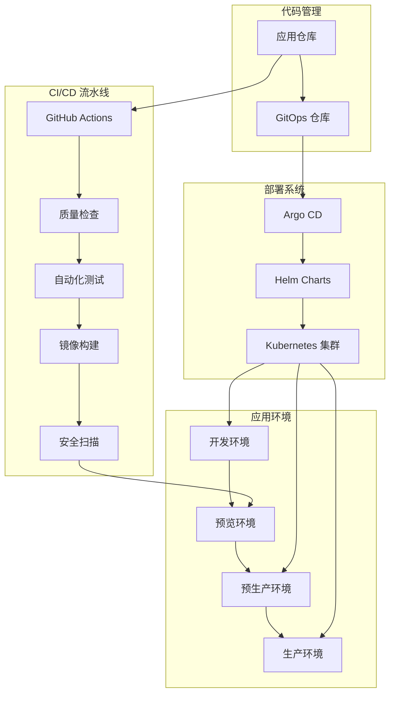
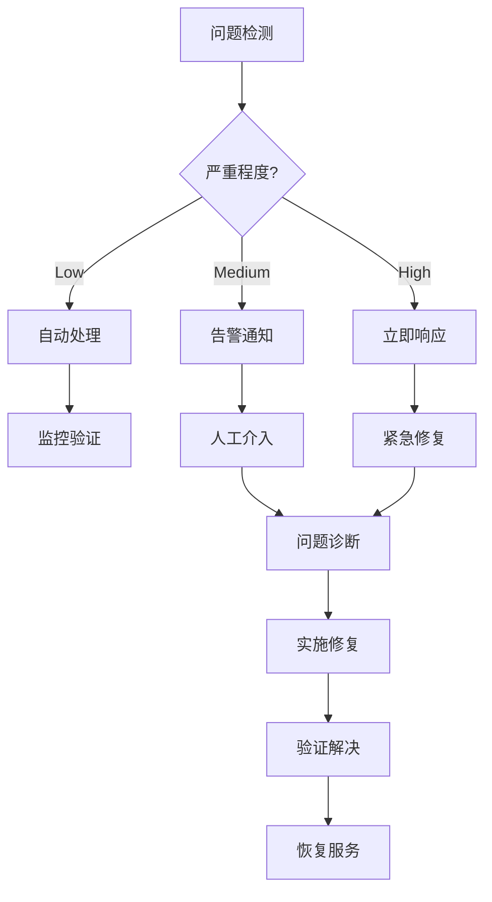

# Spydon 智能告警管理平台 - CI/CD 部署文档


## 🚀 项目概述

Spydon 是一个现代化的智能告警管理和根因分析平台，专为 Kubernetes 环境设计。本文档详细描述了 Spydon 的完整 CI/CD 流水线，采用 GitOps 模式，通过 Argo CD 实现自动化部署。

### 🎯 核心特性

- **实时告警聚合**：多集群告警关联和可视化
- **AI 驱动的根因分析**：HolmesGPT 集成，智能诊断
- **多环境支持**：开发、预览、预生产、生产环境
- **GitOps 部署**：声明式配置，自动化同步
- **蓝绿部署**：零停机发布，自动回滚
- **全面监控**：APM、日志聚合、性能指标

## 📋 目录

- [系统架构](#系统架构)
- [快速开始](#快速开始)
- [CI/CD 流程](#cicd-流程)
- [环境管理](#环境管理)
- [部署指南](#部署指南)
- [监控运维](#监控运维)
- [故障处理](#故障处理)
- [最佳实践](#最佳实践)

## 🏗️ 系统架构



### 技术栈

**后端服务**
- Go 1.23+ + Gin 框架
- PostgreSQL 数据持久化
- Redis 缓存和会话
- MinIO 对象存储

**前端服务**
- Next.js 16 + React 19
- TypeScript 类型安全
- Tailwind CSS 响应式设计

**AI 集成**
- HolmesGPT 智能分析
- Prometheus 指标收集
- Elasticsearch 日志分析

**容器化和编排**
- Docker 容器化
- Kubernetes 集群管理
- Helm 包管理

**CI/CD 工具链**
- GitHub Actions 自动化
- Argo CD GitOps 部署
- 自动化测试套件

## 🚀 快速开始

### 前置要求

- Kubernetes 集群 (v1.25+)
- kubectl 和 helm 工具
- Docker 容器运行时
- GitHub 组织仓库权限

### 1. 基础设施部署

#### 安装 Argo CD

```bash
# 安装 Argo CD
kubectl create namespace argocd
kubectl apply -n argocd -f https://raw.githubusercontent.com/argoproj/argo-cd/stable/manifests/install.yaml

# 获取管理员密码
kubectl -n argocd get secret argocd-initial-admin-secret -o jsonpath="{.data.password}" | base64 -d

# 端口转发访问
kubectl port-forward svc/argocd-server -n argocd 8080:443
```

#### 配置 Argo CD 应用

```bash
# 部署 Spydon 应用
kubectl apply -f infrastructure/argocd/
```

### 2. 应用部署

```bash
# 部署开发环境
./infrastructure/gitops/scripts/sync.sh sync development

# 检查部署状态
./infrastructure/gitops/scripts/sync.sh status development
```

## 🔄 CI/CD 流程

### 完整流水线架构

```mermaid
sequenceDiagram
    participant Dev as 开发者
    participant GH as GitHub
    participant CI as GitHub Actions
    participant Registry as 容器仓库
    participant Preview as 预览环境
    participant ArgoCD as Argo CD
    member Prod as 生产环境

    Dev->>GH: 推送代码
    GH->>CI: 触发流水线
    CI->>CI: 代码检查
    CI->>CI: 自动测试
    CI->>Registry: 构建镜像
    CI->>Preview: 部署预览
    CI->>Dev: 通知就绪

    Dev->>Preview: 人工测试
    Dev->>GH: 合并 PR

    CI->>ArgoCD: 更新配置
    ArgoCD->>Prod: 自动部署
    Prod-->>CI: 健康检查
    CI->>Dev: 发布完成
```

### 流水线阶段

#### 1. 代码质量检查
- 代码格式化和 linting
- 安全漏洞扫描
- 依赖安全检查

#### 2. 自动化测试
- 后端单元测试
- 前端组件测试
- API 集成测试

#### 3. 构建和部署
- Docker 镜像构建
- 容器镜像安全扫描
- 推送到镜像仓库

#### 4. 环境部署
- 预览环境创建（PR 触发）
- 预生产环境部署（main 分支）
- 生产环境手动发布

## 🌍 环境管理

### 环境概览

| 环境 | 用途 | 自动部署 | 数据来源 | 监控级别 |
|------|------|----------|----------|----------|
| **Development** | 开发测试 | ✅ | 测试数据 | 基础 |
| **Preview** | PR 验收 | ✅ | 脱敏数据 | 轻量 |
| **Staging** | 预生产验证 | ✅ | 生产快照 | 完整 |
| **Production** | 正式服务 | ❌ | 真实数据 | 全面 |

### 预览环境

为每个 Pull Request 自动创建临时预览环境：

```bash
# 创建预览环境（自动执行）
./infrastructure/preview-env/create-preview.sh \
  --pr-number 123 \
  --commit abc123def \
  --backend-image ghcr.io/your-org/spydon/backend \
  --frontend-image ghcr.io/your-org/spydon/frontend

# 访问预览环境
# https://pr-123.spydon-preview.local
```

### 生产环境发布

```bash
# 发布到生产环境（需要审批）
./infrastructure/gitops/scripts/sync.sh deploy production v1.2.3

# 检查发布状态
./infrastructure/gitops/scripts/sync.sh status production

# 紧急回滚
./infrastructure/gitops/scripts/sync.sh rollback production
```

## 📊 部署指南

### 开发环境部署

```bash
# 1. 克隆代码仓库
git clone https://github.com/your-org/spydon.git
cd spydon

# 2. 配置环境变量
cp apps/backend/.env.example apps/backend/.env
# 编辑 .env 文件配置

# 3. 启动依赖服务
docker-compose -f infrastructure/docker/docker-compose.yml up -d

# 4. 启动应用
# 后端
cd apps/backend && go run ./cmd/server

# 前端（新终端）
cd apps/frontend && npm run dev
```

### Kubernetes 集群部署

```bash
# 1. 准备 Kubernetes 集群
# 确保 Ingress Controller 和 cert-manager 已安装

# 2. 配置密钥
kubectl create secret generic robusta-secrets \
  --from-env-file=infrastructure/secrets/production.env \
  -n spydon-production

# 3. 部署应用
kubectl apply -f infrastructure/k8s/

# 4. 验证部署
kubectl get all -n spydon-production
kubectl logs -f deployment/robusta-backend -n spydon-production
```

### GitOps 部署

```bash
# 1. 设置 GitOps 仓库
git clone https://github.com/your-org/spydon-gitops.git
cd spydon-gitops

# 2. 配置环境
cp environments/production/secrets.env.template environments/production/.secrets.env
# 编辑密钥配置

# 3. 提交配置
git add .
git commit -m "Configure production environment"
git push origin main

# 4. Argo CD 自动同步
argocd app sync spydon-production
```

## 📈 监控运维

### 应用监控

- **指标收集**: Prometheus + Grafana
- **日志聚合**: ELK Stack (Elasticsearch + Logstash + Kibana)
- **链路追踪**: Jaeger + OpenTelemetry
- **告警通知**: Slack/Teams 集成

### 关键指标

```yaml
# 应用性能指标
- http_requests_total: HTTP 请求总数
- http_request_duration_seconds: 请求响应时间
- error_rate: 错误率
- active_connections: 活跃连接数

# 业务指标
- alerts_total: 告警总数
- alerts_resolved: 已解决告警数
- rca_analysis_count: RCA 分析次数
- user_sessions: 用户会话数
```

### 告警策略

| 告警级别 | CPU > | 内存 > | 错误率 > | 响应时间 > |
|----------|-------|---------|----------|------------|
| **Warning** | 70% | 80% | 5% | 1s |
| **Critical** | 90% | 95% | 10% | 2s |
| **Emergency** | 95% | 98% | 20% | 5s |

## 🔧 故障处理

### 常见问题诊断

#### 1. 部署失败

```bash
# 检查 Argo CD 状态
argocd app get spydon-production

# 检查资源状态
kubectl get all -n spydon-production

# 查看详细错误
kubectl describe deployment robusta-backend -n spydon-production

# 查看事件日志
kubectl get events -n spydon-production --sort-by='.lastTimestamp'
```

#### 2. 健康检查失败

```bash
# 检查 Pod 状态
kubectl get pods -n spydon-production

# 查看 Pod 日志
kubectl logs -f deployment/robusta-backend -n spydon-production

# 手动健康检查
kubectl exec -it deployment/robusta-backend -n spydon-production -- curl localhost:8080/health

# 检查资源使用
kubectl top pods -n spydon-production
```

#### 3. 网络连接问题

```bash
# 检查服务配置
kubectl get svc -n spydon-production
kubectl describe svc robusta-backend -n spydon-production

# 测试内部连通性
kubectl exec -it deployment/robusta-frontend -n spydon-production -- nslookup robusta-backend

# 检查 Ingress
kubectl get ingress -n spydon-production
kubectl describe ingress robusta-ingress -n spydon-production
```

### 应急响应流程



### 自动恢复机制

```yaml
# 自动重启策略
apiVersion: apps/v1
kind: Deployment
metadata:
  name: robusta-backend
spec:
  template:
    spec:
      containers:
      - name: backend
        livenessProbe:
          httpGet:
            path: /health
            port: 8080
          initialDelaySeconds: 30
          periodSeconds: 10
          failureThreshold: 3
        readinessProbe:
          httpGet:
            path: /ready
            port: 8080
          initialDelaySeconds: 5
          periodSeconds: 5
          failureThreshold: 3
```

## 💡 最佳实践

### 1. 代码质量
- 编写全面的单元测试
- 使用代码覆盖率工具
- 定期执行安全扫描
- 遵循 Go 和 React 最佳实践

### 2. 部署策略
- 采用蓝绿部署模式
- 实施渐进式发布
- 配置自动回滚机制
- 定期进行灾难演练

### 3. 监控运维
- 设置关键业务指标监控
- 配置多级告警机制
- 建立应急响应流程
- 定期性能优化

### 4. 安全防护
- 定期更新依赖包
- 实施最小权限原则
- 配置网络安全策略
- 定期安全审计

### 5. 成本优化
- 合理配置资源限制
- 使用自动扩缩容
- 优化镜像大小
- 清理未使用资源

## 📚 相关文档

- [详细部署指南](docs/deployment-guide.md)
- [环境管理策略](infrastructure/environments/environment-strategy.md)
- [CI/CD 架构设计](docs/ci-cd-architecture.md)
- [API 文档](docs/api-documentation.md)
- [开发指南](docs/development-guide.md)

## 🆘 支持和帮助

### 技术支持
- **文档**: 查看 [在线文档](https://docs.spydon.com)
- **问题反馈**: [GitHub Issues](https://github.com/your-org/spydon/issues)
- **功能请求**: [GitHub Discussions](https://github.com/your-org/spydon/discussions)

### 联系方式
- **技术支持**: support@spydon.com
- **紧急响应**: emergency@spydon.com
- **销售咨询**: sales@spydon.com

---

## 🎉 总结

Spydon 的 CI/CD 系统通过现代化的 DevOps 实践，实现了：

✅ **自动化流水线** - 从代码提交到部署的全流程自动化
✅ **GitOps 模式** - 声明式配置，版本控制驱动
✅ **多环境支持** - 开发、测试、预生产、生产环境
✅ **零停机部署** - 蓝绿部署，渐进式发布
✅ **全面监控** - APM、日志、指标全方位覆盖
✅ **自动恢复** - 智能故障检测和自动修复
✅ **安全保障** - 多层次安全防护措施

通过遵循本指南，团队可以快速建立高效、可靠的持续交付流程，确保软件质量和系统稳定性。

---

**让告警管理变得智能和高效！** 🚀
