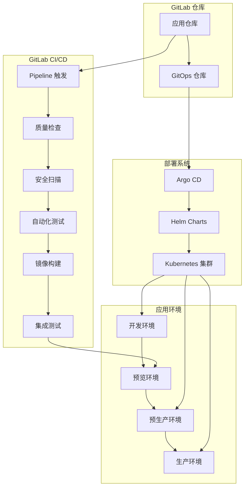

# Spydon 智能告警管理平台 - GitLab CI/CD 版本


## 🚀 项目概述

Spydon 是一个现代化的智能告警管理和根因分析平台，专为 Kubernetes 环境设计。本项目已完全适配 **GitLab CI/CD** 流程，通过 GitOps 模式实现自动化部署。

### 🎯 核心特性

- **实时告警聚合**：多集群告警关联和可视化
- **AI 驱动的根因分析**：HolmesGPT 集成，智能诊断
- **GitLab CI/CD**：完整的自动化流水线
- **多环境支持**：开发、预览、预生产、生产环境
- **GitOps 部署**：声明式配置，Argo CD 自动同步
- **蓝绿部署**：零停机发布，自动回滚
- **全面监控**：APM、日志聚合、性能指标

## 📋 目录

- [快速开始](#-快速开始)
- [GitLab CI/CD 流程](#-gitlab-cicd-流程)
- [环境管理](#-环境管理)
- [部署指南](#-部署指南)
- [监控运维](#-监控运维)
- [故障处理](#-故障处理)
- [最佳实践](#-最佳实践)

## 🏗️ GitLab CI/CD 架构



### 技术栈

**后端服务**
- Go 1.23+ + Gin 框架
- PostgreSQL 数据持久化
- Redis 缓存和会话
- MinIO 对象存储

**前端服务**
- Next.js 16 + React 19
- TypeScript 类型安全
- Tailwind CSS 响应式设计

**AI 集成**
- HolmesGPT 智能分析
- Prometheus 指标收集
- Elasticsearch 日志分析

**容器化和编排**
- Docker 容器化
- Kubernetes 集群管理
- Helm 包管理

**CI/CD 工具链**
- GitLab CI/CD 自动化
- Argo CD GitOps 部署
- Docker Registry 镜像存储

## 🚀 快速开始

### 前置要求

- GitLab 实例（GitLab.com 或自托管）
- Kubernetes 集群 (v1.25+)
- kubectl 和 helm 工具
- GitLab Runner 配置

### 1. GitLab 项目设置

#### 创建项目

```bash
# 克隆现有项目
git clone https://gitlab.com/your-org/spydon.git
cd spydon

# 配置远程仓库
git remote set-url origin https://gitlab.com/your-org/spydon.git
git push -u origin main
```

#### 配置环境

在 GitLab 项目中创建以下环境：
- `development` - 开发环境
- `staging` - 预生产环境
- `production` - 生产环境

#### 配置 CI/CD 变量

进入 `Settings > CI/CD > Variables` 添加必要变量：

```bash
# 通用配置
CI_REGISTRY=registry.gitlab.com
DOCKER_PLATFORM=linux/amd64,linux/arm64
BUILD_TIMEOUT=600

# Kubernetes 配置 (Base64 编码的 kubeconfig)
KUBECONFIG_DATA=...

# 通知配置 (可选)
SLACK_WEBHOOK_URL=https://hooks.slack.com/services/...
```

### 2. GitLab Runner 配置

#### 安装 Runner

```bash
# 安装 GitLab Runner
curl -L https://packages.gitlab.com/install/repositories/gitlab-runner/script.deb.sh | sudo bash
sudo apt-get install gitlab-runner

# 注册 Docker Runner
sudo gitlab-runner register \
  --url https://gitlab.com/ \
  --registration-token $REGISTRATION_TOKEN \
  --description "spydon-docker-runner" \
  --executor "docker" \
  --docker-image "docker:24.0.6" \
  --docker-privileged
```

### 3. 基础设施部署

#### 安装 Argo CD

```bash
# 安装 Argo CD
kubectl create namespace argocd
kubectl apply -n argocd -f https://raw.githubusercontent.com/argoproj/argo-cd/stable/manifests/install.yaml

# 配置 Argo CD 应用
kubectl apply -f infrastructure/argocd/
```

#### 配置 GitOps 仓库

```bash
# 创建 GitOps 仓库
git clone https://gitlab.com/your-org/spydon-gitops.git
cd spydon-gitops

# 复制配置模板
cp -r infrastructure/gitops/environments/* .
cp infrastructure/gitops/environments/production/secrets.env.template production/.secrets.env

# 编辑配置文件
# production/.secrets.env

# 提交配置
git add .
git commit -m "Initial GitOps configuration"
git push origin main
```

### 4. 应用部署

```bash
# 部署开发环境
# 在 GitLab UI 中手动触发 pipeline 或推送代码

# 检查部署状态
# 在 GitLab > CI/CD > Environments 中查看
```

## 🔄 GitLab CI/CD 流程

### 完整流水线架构

```mermaid
sequenceDiagram
    participant Dev as 开发者
    participant GitLab as GitLab
    participant CI as GitLab CI
    participant Registry as Container Registry
    participant Preview as 预览环境
    participant ArgoCD as Argo CD
    member Prod as 生产环境

    Dev->>GitLab: 推送代码/MR
    GitLab->>CI: 触发流水线
    CI->>CI: 代码检查
    CI->>CI: 安全扫描
    CI->>CI: 自动化测试
    CI->>Registry: 构建镜像
    CI->>Preview: 部署预览
    CI->>Dev: 通知就绪

    Dev->>Preview: 人工测试
    Dev->>GitLab: 合并 MR

    CI->>ArgoCD: 更新配置
    ArgoCD->>Prod: 自动部署
    Prod-->>CI: 健康检查
    CI->>Dev: 发布完成
```

### 流水线阶段详解

#### 1. 代码质量检查 (`validate`)

- Go 代码格式化和静态分析
- Node.js 代码 linting 和类型检查
- 生成质量报告

#### 2. 安全扫描 (`security`)

- 代码仓库漏洞扫描
- 依赖安全检查
- 生成安全报告

#### 3. 自动化测试 (`test`)

- 后端 Go 单元测试
- 前端 Jest 单元测试
- 代码覆盖率分析

#### 4. 镜像构建 (`build`)

- 多架构 Docker 镜像构建
- 镜像安全扫描
- 推送到 GitLab Registry

#### 5. 集成测试 (`integration-test`)

- 端到端测试环境
- API 集成测试
- 前端集成测试

#### 6. 环境部署

- `deploy-preview` - MR 预览环境部署
- `deploy-staging` - 预生产环境部署
- `deploy-production` - 生产环境部署

## 🌍 环境管理

### 环境概览

| 环境 | 用途 | 自动部署 | 数据来源 | 监控级别 |
|------|------|----------|----------|----------|
| **Development** | 开发测试 | ✅ | 测试数据 | 基础 |
| **Preview** | MR 验收 | ✅ | 脱敏数据 | 轻量 |
| **Staging** | 预生产验证 | ✅ | 生产快照 | 完整 |
| **Production** | 正式服务 | ❌ | 真实数据 | 全面 |

### 环境配置

#### 开发环境

```yaml
development:
  replicas: 1
  resources:
    backend: { memory: "256Mi", cpu: "250m" }
    frontend: { memory: "128Mi", cpu: "100m" }
  auto_stop_in: "7 days"
```

#### 预览环境

- 为每个 MR 自动创建
- URL: `https://pr-{MR_IID}.spydon-preview.local`
- MR 合并后自动清理

#### 预生产环境

```yaml
staging:
  replicas: 2
  resources:
    backend: { memory: "512Mi", cpu: "500m" }
    frontend: { memory: "256Mi", cpu: "200m" }
  strategy: blue_green
```

#### 生产环境

```yaml
production:
  replicas: 3
  resources:
    backend: { memory: "1Gi", cpu: "1000m" }
    frontend: { memory: "512Mi", cpu: "400m" }
  strategy: blue_green
  health_check:
    timeout: 60
    retries: 3
```

## 📊 部署指南

### 开发环境部署

**触发条件**：推送到任何分支

**自动流程**：
1. GitLab CI 自动触发
2. 代码质量和安全检查
3. 构建和测试
4. 自动部署到开发环境

### 预览环境部署

**触发条件**：创建/更新 Merge Request

**自动流程**：
1. CI 流水线完成
2. 创建临时命名空间
3. 部署应用到预览环境
4. 配置 Ingress 和域名
5. 发送 Slack 通知

**访问预览环境**：
```bash
# 在 GitLab UI 中查看
# Environments > preview/{MR_IID}
```

### 预生产环境部署

**触发条件**：main 分支更新

**手动流程**：
1. 在 GitLab UI 中手动触发
2. 更新 GitOps 配置
3. Argo CD 自动同步
4. 健康检查验证

```bash
# 手动触发命令
# GitLab > CI/CD > Pipelines > Run Pipeline
```

### 生产环境部署

**触发条件**：手动审批

**蓝绿部署流程**：
1. 部署到绿环境
2. 验证绿环境健康
3. 切换流量到绿环境
4. 验证生产环境
5. 清理蓝环境

## 📈 监控运维

### GitLab CI 监控

- **流水线状态**：实时监控所有流水线状态
- **作业性能**：跟踪作业执行时间和资源使用
- **部署历史**：完整的部署历史记录

### 应用监控

- **指标收集**：Prometheus + Grafana
- **日志聚合**：ELK Stack
- **链路追踪**：Jaeger + OpenTelemetry
- **告警通知**：Slack/Teams 集成

### 关键指标

```yaml
# CI/CD 指标
- pipeline_duration_seconds
- job_success_rate
- build_failure_rate

# 应用性能指标
- http_requests_total
- http_request_duration_seconds
- error_rate
- active_connections
```

## 🔧 故障处理

### 常见问题诊断

#### 流水线失败

```bash
# 检查作业日志
# GitLab UI > CI/CD > Jobs > Failed Job

# 本地调试
gitlab-runner exec docker <job-name>

# 检查 Runner 状态
sudo gitlab-runner status
sudo gitlab-runner verify
```

#### 部署失败

```bash
# 检查 Argo CD 状态
argocd app get spydon-production

# 检查 Kubernetes 资源
kubectl get all -n spydon-production
kubectl describe deployment robusta-backend -n spydon-production

# 查看事件
kubectl get events -n spydon-production
```

### 应急响应

#### 自动回滚

```yaml
# Argo CD 自动回滚
syncPolicy:
  automated:
    prune: true
    selfHeal: true
  retry:
    limit: 5
    backoff:
      duration: 5s
      factor: 2
```

#### 手动回滚

```bash
# 使用 GitOps 脚本回滚
./infrastructure/gitops/scripts/sync.sh rollback production

# 或使用 kubectl
kubectl rollout undo deployment/robusta-backend -n spydon-production
```

## 💡 最佳实践

### 1. CI/CD 配置

- **缓存优化**：合理配置 npm 和 Go mod 缓存
- **并行执行**：合理分配作业并行度
- **资源限制**：设置适当的资源请求和限制

### 2. 安全实践

- **变量保护**：敏感信息使用受保护变量
- **权限最小化**：按需分配 GitLab 权限
- **定期轮换**：定期更新密钥和访问令牌

### 3. 环境管理

- **环境隔离**：完全隔离不同环境的资源
- **命名规范**：统一的命名和标签规范
- **清理策略**：及时清理不再使用的资源

### 4. 监控运维

- **全面监控**：覆盖所有关键指标
- **及时告警**：合理的告警阈值和升级策略
- **文档完善**：保持操作手册和故障处理指南更新

## 📚 相关文档

- [详细部署指南](docs/gitlab-ci-deployment.md)
- [GitLab CI/CD 配置](.gitlab/gitlab-config.yml)
- [环境部署策略](.gitlab/environments.yml)
- [API 文档](docs/api-documentation.md)
- [开发指南](docs/development-guide.md)

## 🆘 支持和帮助

### 技术支持

- **GitLab 文档**：https://docs.gitlab.com
- **项目 Issues**：https://gitlab.com/your-org/spydon/-/issues
- **项目 Wiki**：https://gitlab.com/your-org/spydon/-/wikis

### 联系方式

- **技术支持**：support@spydon.com
- **DevOps 团队**：devops@spydon.com
- **紧急响应**：emergency@spydon.com

---

## 🎉 总结

通过 GitLab CI/CD，Spydon 项目实现了：

✅ **全自动化流水线**：从代码提交到部署的全流程自动化
✅ **GitOps 模式**：声明式配置，版本控制驱动
✅ **多环境支持**：开发、预览、预生产、生产环境
✅ **零停机部署**：蓝绿部署，渐进式发布
✅ **全面监控**：APM、日志、指标全方位覆盖
✅ **自动恢复**：智能故障检测和自动修复
✅ **安全保障**：多层次安全防护措施

通过遵循本指南和最佳实践，团队可以快速建立高效、可靠的 GitLab CI/CD 持续交付流程，确保软件质量和系统稳定性。

---

**让告警管理变得智能和高效！** 🚀

*基于 GitLab CI/CD 的现代化 DevOps 实践*
