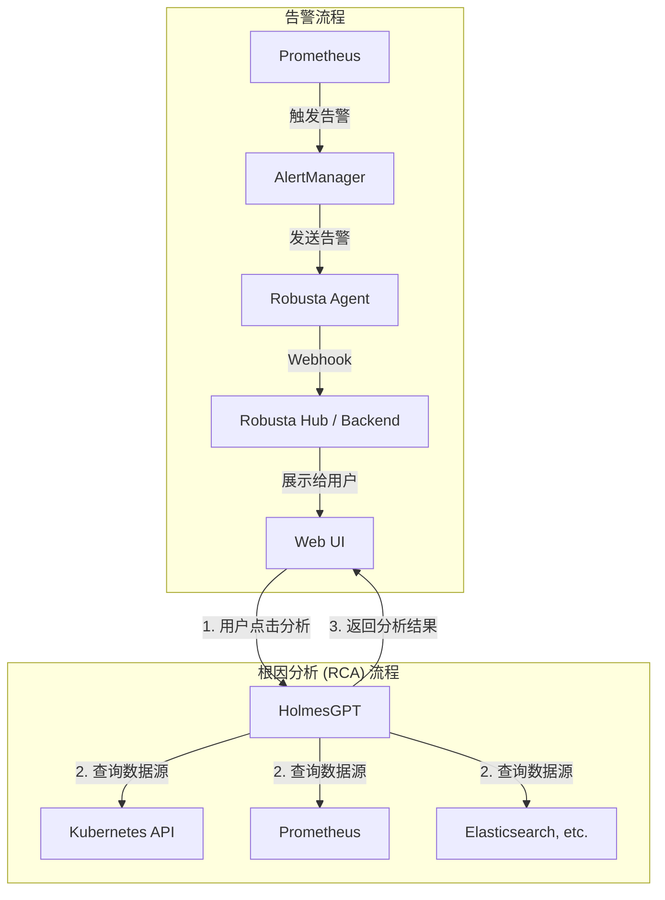

# Robusta Web

Robusta Web 是一个用于展示和分析 Robusta 平台告警的 Web 应用界面。它提供了告警详情、AI 分析 (HolmesGPT)、集群监控等功能。

## 目录

- [技术栈](#技术栈)
- [先决条件](#先决条件)
- [快速启动 (推荐)](#快速启动-推荐)
- [开发模式](#开发模式)
  - [启动后端 (Go)](#启动后端-go)
  - [启动前端 (Next.js)](#启动前端-nextjs)
- [Robusta 集成与部署](#robusta-集成与部署)
- [主要依赖](#主要依赖)

## 技术栈

- **后端**: Go (Gin 框架)
- **前端**: TypeScript, React (Next.js 框架)
- **数据库**: PostgreSQL
- **对象存储**: MinIO
- **缓存**: Redis
- **容器化**: Docker & Docker Compose
- **部署**: Kubernetes

## 系统架构

下面是系统的基本架构和数据流图。

### 告警流程
Prometheus 发现问题并触发告警，经由 AlertManager 发送给在 Kubernetes 集群中运行的 Robusta Agent。Agent 对告警进行丰富和处理，并通过 Webhook 将其发送到 Robusta Web 后端，最终展示在前端界面上。

### 根因分析 (RCA) 流程
当用户在界面上针对某个告警点击“根因分析”时，前端会调用 HolmesGPT 服务。HolmesGPT 会根据上下文，主动查询来自 Kubernetes API、Prometheus、Elasticsearch 等多种数据源的信息，进行智能分析，并将分析结果返回给前端展示给用户。

> **开发注意**: 在本地开发模式下，前端应用 (运行在 `localhost:3000`) 需要能够访问到集群内部的 HolmesGPT 服务。您需要使用 `kubectl` 将 HolmesGPT 服务的端口转发到本地。假设 HolmesGPT 服务部署在 `robusta` 命名空间中，请运行以下命令：
> ```bash
> kubectl port-forward svc/holmesgpt -n robusta 8081:80
> ```
> 这样，前端就可以通过 `http://localhost:8081` 访问到 HolmesGPT 服务了。



## 先决条件

在开始之前，请确保您的开发环境中安装了以下工具：

- [Docker](https://www.docker.com/get-started) 和 Docker Compose
- [Go](https://golang.org/doc/install) (版本 1.23+)
- [Node.js](https://nodejs.org/en/download/) (版本 18+) 和 npm
- [make](https://www.gnu.org/software/make/) (可选，用于简化命令)
- [kubectl](https://kubernetes.io/docs/tasks/tools/) (用于集群部署)
- [Helm](https://helm.sh/docs/intro/install/) (用于集群部署)

## 快速启动 (推荐)

使用 Docker Compose 是启动完整开发环境最简单的方式。此方法会一键启动所有依赖服务（数据库、缓存、对象存储）以及前后端应用。

1.  **配置环境变量**:
    项目包含 `.env.example` 文件作为模板。您需要为后端创建一个 `.env` 文件。

    ```bash
    # 从后端模板复制环境变量文件
    cp backend/.env.example backend/.env
    ```
    > 注意: `docker-compose.yml` 中已为开发环境预设了大部分变量，对于本地开发，您通常无需修改 `backend/.env` 文件。

2.  **启动服务**:
    使用 `make` 命令（推荐）或直接使用 `docker-compose`。

    ```bash
    # 使用 make (推荐)
    make docker-run

    # 或者直接使用 docker-compose
    docker-compose up -d
    ```
    该命令将在后台启动所有服务。数据库初始化脚本位于 `backend/migrations`，会在首次启动时自动执行。

3.  **访问应用**:
    - **前端界面**: [http://localhost:3000](http://localhost:3000)
    - **后端 API**: [http://localhost:8080](http://localhost:8080)
    - **MinIO 控制台**: [http://localhost:9001](http://localhost:9001)

4.  **停止服务**:
    ```bash
    # 使用 make
    make docker-stop

    # 或者直接使用 docker-compose
    docker-compose down
    ```

## 开发模式

如果您希望独立运行前端和后端服务，以便进行更灵活的开发和调试，请遵循以下步骤。

**首先，启动依赖服务：**

```bash
docker-compose up -d postgres minio redis
```

### 启动后端 (Go)

1.  **目录**: 进入后端目录。
    ```bash
    cd backend
    ```

2.  **配置**: 复制并根据需要修改环境变量文件。
    ```bash
    cp .env.example .env
    ```
    > 请确保 `.env` 文件中的数据库、MinIO 和 Redis 连接信息与 `docker-compose.yml` 中定义的一致。

3.  **安装依赖**:
    ```bash
    go mod tidy
    ```

4.  **运行服务**:
    ```bash
    # 使用 make
    make run

    # 或者直接使用 go
    go run ./cmd/server/main.go
    ```
    后端服务将在 `http://localhost:8080` 上运行。

### 启动前端 (Next.js)

1.  **目录**: 进入前端目录。
    ```bash
    cd frontend
    ```

2.  **安装依赖**:
    ```bash
    npm install
    ```

3.  **运行服务**:
    ```bash
    # 使用 make
    make frontend-dev

    # 或者直接使用 npm
    npm run dev
    ```
    前端开发服务器将在 `http://localhost:3000` 上运行。

## Robusta 集成与部署

本项目被设计为与 Robusta Kubernetes 监控平台集成。推荐使用 Helm 进行安装和配置。

### 使用 Helm 安装 Robusta

1.  **添加 Robusta 的 Helm 仓库**:
    ```bash
    helm repo add robusta https://robusta-charts.storage.googleapis.com
    helm repo update
    ```

2.  **创建命名空间**:
    ```bash
    kubectl create namespace robusta
    ```

3.  **安装 Robusta Chart**:
    使用项目提供的 `scripts/robusta-holmesgpt-values-clean.yaml` 文件进行安装。这个配置文件启用了 HolmesGPT 并配置了 `webhook_sink`，用于将告警数据转发到本应用的后端。

    ```bash
    helm install robusta robusta/robusta -n robusta -f scripts/robusta-holmesgpt-values-clean.yaml
    ```

4.  **验证安装**:
    检查 Robusta 的 pod 是否在 `robusta` 命名空间中正常运行。
    ```bash
    kubectl get pods -n robusta
    ```

### 应用部署

安装完 Robusta Agent 后，您需要将本应用（前后端）部署到集群中，以便接收 Agent 发送的数据。

1.  **配置文件**:
    部署配置位于 `k8s/` 目录。您可能需要根据您的集群环境修改 `k8s/configmap.yaml` 和相关的部署脚本。确保 `webhook_sink` 的 `url` (`http://hub-proxy.robusta.svc.cluster.local:8080/api/v1/ingest/robusta-webhook`) 可以正确路由到本应用的后端服务。

2.  **部署脚本**:
    项目提供了多个部署脚本，例如 `scripts/deploy.sh`。
    ```bash
    # 确保您的 kubectl 上下文正确指向目标集群
    kubectl config use-context <your-cluster-context>

    # 运行部署脚本
    ./scripts/deploy.sh
    ```
    > 在运行任何部署脚本之前，请务必仔细阅读其内容，了解它将对您的集群执行哪些操作。

## 主要依赖

### 后端

- `github.com/gin-gonic/gin`: Web 框架
- `gorm.io/gorm`: ORM 库
- `gorm.io/driver/postgres`: PostgreSQL 驱动
- `github.com/minio/minio-go/v7`: MinIO Go SDK
- `github.com/golang-jwt/jwt/v5`: JWT 认证

### 前端

- `next`: React 框架
- `react`: UI 库
- `axios`: HTTP 客户端
- `@tanstack/react-query`: 异步状态管理
- `tailwindcss`: CSS 框架
- `echarts`: 图表库
