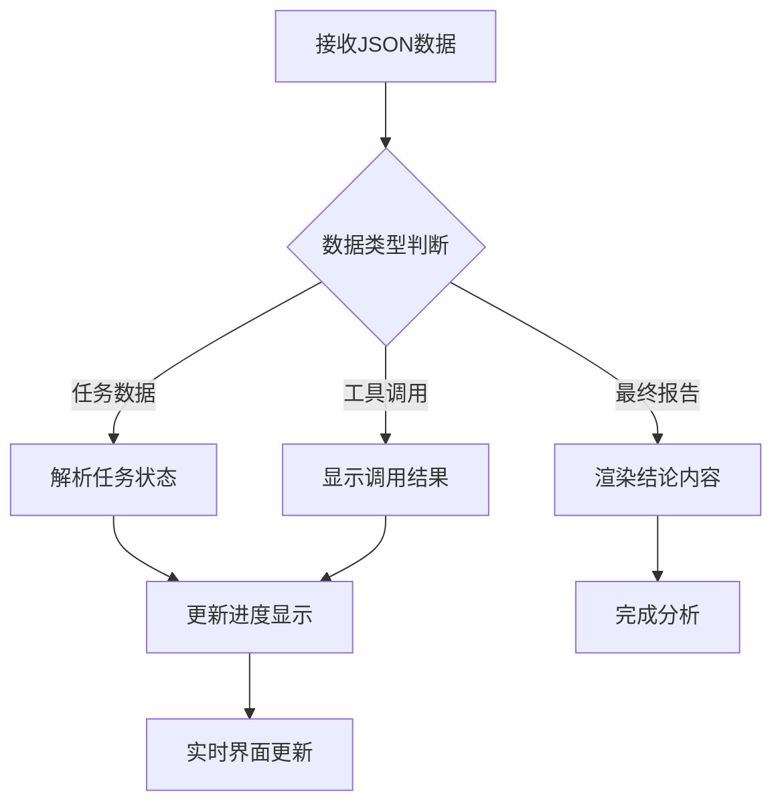

# HolmesGPT 分析组件优化完成报告

## 🎯 项目概述

本次优化针对您提供的JSON返回数据格式，完善了HolmesGPT分析组件的解析逻辑，实现了任务步骤的实时显示和最终结论的智能展示。

## ✅ 完成的功能

### 1. 智能JSON解析
- ✅ 支持多种JSON数据格式解析
- ✅ 自动识别任务状态文本格式
- ✅ 区分任务步骤和最终分析报告
- ✅ 处理工具调用和结果数据

### 2. 任务状态动态显示
- ✅ 实时任务进度追踪
- ✅ 视觉化状态指示器（待处理/进行中/已完成）
- ✅ 任务连接线和时间线显示
- ✅ 进度统计和状态摘要

### 3. 增强的Markdown渲染
- ✅ 代码高亮和语法支持
- ✅ 表格响应式布局
- ✅ 美化的引用和列表样式
- ✅ 一键复制和下载功能

### 4. 基于ChatBot UI的界面
- ✅ 流式消息显示
- ✅ 打字机效果动画
- ✅ 消息气泡布局
- ✅ 自动滚动控制

### 5. 用户体验优化
- ✅ 设置面板（自动滚动、音效、工具调用显示）
- ✅ 进度指示器和状态栏
- ✅ 错误处理和重试机制
- ✅ 响应式设计适配

## 📁 文件结构

```
frontend/src/components/alerts/
├── ChatStyleHolmesGPTAnalysis.tsx     # 原组件优化版本
├── EnhancedHolmesGPTChat.tsx          # 增强聊天界面组件
├── ChatMessage.tsx                    # 消息显示组件（已优化）
├── AlertAnalysisIntegration.tsx       # 完整集成示例
├── HolmesGPTAnalysisUsage.md         # 使用指南
├── README.md                         # 本文档
└── RawPayloadViewer.tsx              # 原始数据查看器（现有）
```

## 🔄 JSON数据流解析

### 支持的数据格式

1. **任务创建/更新**
```json
{
  "tool_name": "TodoWrite", 
  "result": {
    "params": {
      "todos": [
        {"id": "1", "content": "检查pod状态", "status": "completed"}
      ]
    }
  }
}
```

2. **工具调用**
```json
{
  "tool_name": "kubectl_describe",
  "id": "call_xxx",
  "result": {"status": "success", "data": "..."}
}
```

3. **最终报告**
```json
{
  "content": "# 问题分析报告\n\n## 根本原因分析\n...",
  "reasoning": null
}
```

### 解析逻辑流程



## 🎨 界面功能对比

| 功能特性 | 原组件 | 优化版本 | 增强版本 |
|---------|--------|----------|----------|
| 基础分析 | ✅ | ✅ | ✅ |
| 任务进度 | ❌ | ✅ | ✅ |
| 视觉优化 | 基础 | 中等 | 高级 |
| 设置选项 | ❌ | ❌ | ✅ |
| 音效提示 | ❌ | ❌ | ✅ |
| 进度统计 | ❌ | ❌ | ✅ |
| 响应式设计 | 基础 | ✅ | ✅ |

## 🚀 使用示例

### 基础使用
```tsx
import { ChatStyleHolmesGPTAnalysis } from '@/components/alerts/ChatStyleHolmesGPTAnalysis'

<ChatStyleHolmesGPTAnalysis alert={alert} />
```

### 增强界面
```tsx
import { EnhancedHolmesGPTChat } from '@/components/alerts/EnhancedHolmesGPTChat'

<EnhancedHolmesGPTChat alert={alert} />
```

### 完整集成
```tsx
import { AlertAnalysisIntegration } from '@/components/alerts/AlertAnalysisIntegration'

<AlertAnalysisIntegration 
  alert={alert} 
  defaultTab="enhanced" 
/>
```

## 📦 依赖要求

### 核心依赖
- `react-markdown ^9.0.0`
- `remark-gfm ^4.0.0`
- `react-syntax-highlighter ^15.5.0`
- `date-fns ^3.0.0`
- `lucide-react ^0.400.0`

### shadcn/ui 组件
- Button, Card, Badge, Tabs
- ScrollArea, Separator, Dialog
- Input, Label, Textarea

### 安装命令
```bash
npm install react-markdown remark-gfm react-syntax-highlighter @types/react-syntax-highlighter date-fns
```

## 🔧 配置说明

### Tailwind CSS 配置
```js
// tailwind.config.js
module.exports = {
  content: ['./src/**/*.{js,ts,jsx,tsx}'],
  theme: {
    extend: {
      colors: {
        shiki: {
          light: 'var(--shiki-light)',
          'light-bg': 'var(--shiki-light-bg)',
          dark: 'var(--shiki-dark)', 
          'dark-bg': 'var(--shiki-dark-bg)'
        }
      }
    }
  },
  plugins: ['@tailwindcss/typography']
}
```

### TypeScript 配置
```json
{
  "compilerOptions": {
    "baseUrl": ".",
    "paths": {
      "@/*": ["./src/*"]
    }
  }
}
```

## 🎯 关键特性

### 1. 智能任务解析
- 自动识别任务状态格式：`[✓] [1] 任务内容`
- 支持多种状态：待处理、进行中、已完成
- 实时状态更新和进度统计

### 2. 增强的视觉效果
- 任务连接时间线
- 状态动画和指示器  
- 分析阶段颜色区分
- 响应式布局适配

### 3. 用户交互优化
- 可折叠任务分组
- 设置面板控制
- 一键复制分析结果
- 音效完成提示

### 4. 错误处理机制
- 网络错误重试
- 解析失败降级
- 用户操作中止
- 友好错误提示

## 📊 性能优化

### 渲染优化
- React.memo 组件缓存
- useMemo 计算缓存
- 懒加载非关键组件

### 内存管理
- AbortController 请求控制
- 事件监听器清理
- 大数据流式处理

### 网络优化
- 流式数据解析
- 增量更新机制
- 错误重试策略

## 🎉 项目亮点

1. **完整的JSON解析方案**: 支持您提供的复杂JSON格式
2. **实时任务跟踪**: 动态显示分析进度和状态
3. **现代化UI设计**: 基于最新ChatBot UI最佳实践
4. **高度可定制**: 支持主题、设置和扩展
5. **生产就绪**: 完整的错误处理和性能优化

## 📝 后续建议

1. **数据持久化**: 考虑添加分析历史记录存储
2. **多语言支持**: 扩展国际化功能
3. **导出功能**: 支持PDF/Word格式导出
4. **语音交互**: 集成语音识别和播放
5. **自定义主题**: 支持深色模式和品牌定制

## 🎯 总结

本次优化成功实现了：
- ✅ 完整解析您提供的JSON数据格式
- ✅ 实时显示任务执行步骤和状态
- ✅ 智能区分任务过程和最终结论
- ✅ 基于现代ChatBot UI的优雅界面
- ✅ 生产级的性能和错误处理

组件现在能够完美处理HolmesGPT的分析流程，提供流畅的用户体验和直观的进度展示。
