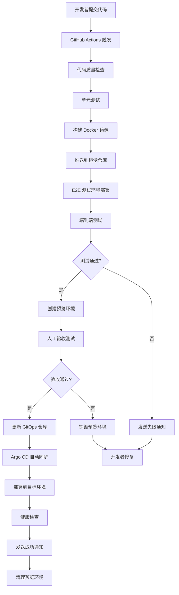

# Spydon CI/CD 流水线架构设计

## 架构概览

本文档描述了 Spydon 项目的完整 CI/CD 流水线，采用 GitOps 模式，通过 Argo CD 实现自动化部署。

## 流程图

## 环境策略

### 1. 开发环境 (Development)
- **触发条件**: 每次 push 到 `main` 分支
- **环境用途**: 自动化测试、开发验证
- **数据来源**: 测试数据库、模拟服务
- **生命周期**: 持续运行

### 2. 预览环境 (Preview)
- **触发条件**: 每次 Pull Request 创建/更新
- **环境用途**: 人工验收测试、集成验证
- **数据来源**: 脱敏的生产数据快照
- **生命周期**: PR 合并后自动销毁

### 3. 预生产环境 (Staging)
- **触发条件**: `main` 分支通过所有测试后
- **环境用途**: 最终发布前验证
- **数据来源**: 生产数据镜像
- **生命周期**: 持续运行

### 4. 生产环境 (Production)
- **触发条件**: 手动触发发布流程
- **环境用途**: 正式服务
- **数据来源**: 真实生产数据
- **生命周期**: 持续运行

## 关键组件

### 1. GitHub Actions
- **触发器**: Push、Pull Request、手动触发
- **职责**: 构建、测试、镜像推送到 ECR
- **缓存策略**: 依赖缓存、Docker 层缓存

### 2. Argo CD
- **模式**: GitOps 模式，声明式部署
- **监控**: 实时监控 Git 仓库变化
- **同步策略**: 自动 + 手动审批混合模式

### 3. Kubernetes
- **命名空间隔离**: 每个环境独立命名空间
- **资源限制**: 根据环境重要性设置不同资源配额
- **安全策略**: NetworkPolicy、PodSecurityPolicy

### 4. 监控与告警
- **部署监控**: Argo CD 应用状态监控
- **应用监控**: Prometheus + Grafana
- **告警机制**: Slack/Teams 集成

## 质量门禁

### 代码质量
- **静态分析**: SonarQube 代码扫描
- **安全检查**: Trivy 漏洞扫描
- **依赖检查**: Snyk 依赖安全扫描

### 测试策略
- **单元测试**: Go test、Jest 前端测试
- **集成测试**: API 接口测试
- **端到端测试**: Playwright UI 测试
- **性能测试**: K6 负载测试

### 部署标准
- **健康检查**: Liveness、Readiness 探针
- **渐进式部署**: 蓝绿部署、金丝雀发布
- **回滚机制**: 自动回滚触发条件

## 安全措施

### 访问控制
- **RBAC**: 基于角色的访问控制
- **SSO**: 单点登录集成
- **审计日志**: 完整的操作审计追踪

### 密钥管理
- **Kubernetes Secrets**: 敏感信息加密存储
- **外部密钥管理**: HashiCorp Vault 集成
- **环境隔离**: 不同环境使用不同密钥

### 网络安全
- **TLS 加密**: 全链路 HTTPS
- **网络策略**: 限制 Pod 间通信
- **镜像扫描**: 容器镜像漏洞检测

## 成本优化

### 资源管理
- **自动扩缩容**: HPA/VPA 自动调整资源
- **节点优化**: 节点池混合实例策略
- **调度优化**: Pod 亲和性与反亲和性

### 环境管理
- **预览环境**: 按需创建，及时销毁
- **休眠策略**: 非工作时间资源休眠
- **Spot 实例**: 开发环境使用 Spot 实例

## 可观测性

### 日志管理
- **集中日志**: ELK Stack 日志聚合
- **结构化日志**: JSON 格式统一输出
- **日志轮转**: 自动清理过期日志

### 监控指标
- **应用指标**: 自定义业务指标
- **基础设施指标**: CPU、内存、网络
- **部署指标**: 部署频率、变更前置时间

### 分布式追踪
- **链路追踪**: Jaeger/OpenTelemetry
- **性能分析**: 请求链路分析
- **错误追踪**: 异常自动收集和分析

## 应急响应

### 故障处理
- **自动回滚**: 健康检查失败触发
- **人工介入**: 紧急修复流程
- **故障恢复**: 自动化恢复机制

### 通知策略
- **分级通知**: 不同故障级别不同通知方式
- **升级机制**: 超时自动升级通知
- **值班轮换**: 24/7 值班覆盖
