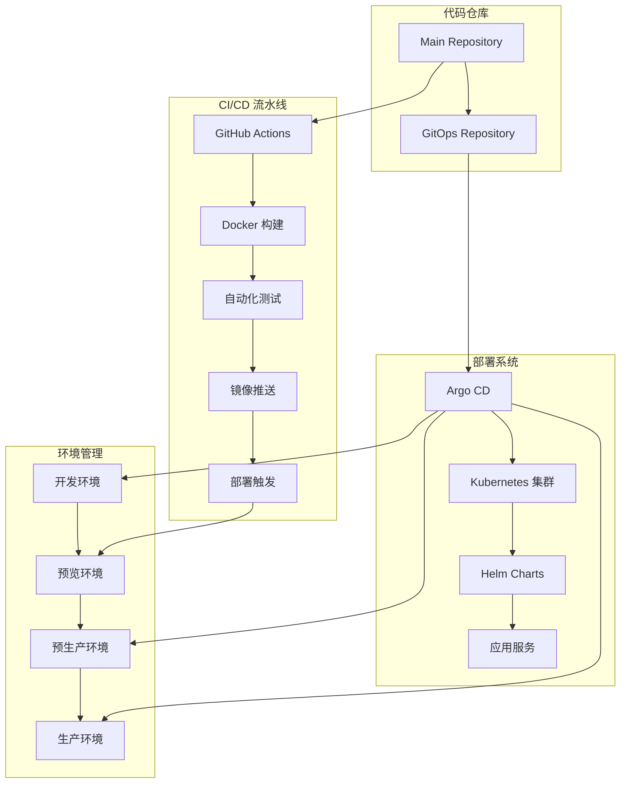
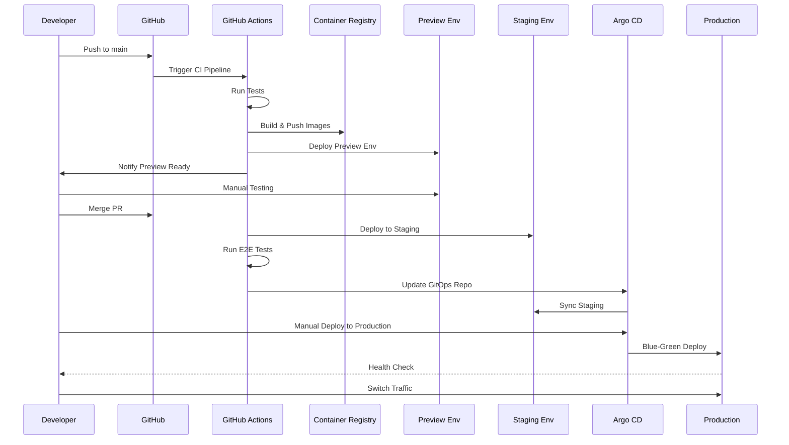

# Spydon CI/CD 部署指南

## 概述

本指南详细介绍了 Spydon 项目的 CI/CD 流程、部署策略和运维操作。Spydon 采用现代化的 DevOps 实践，通过 GitOps 模式实现自动化部署。

## 系统架构



## 快速开始

### 前置要求

- Kubernetes 集群 (v1.25+)
- kubectl 和 helm 工具
- Docker 容器运行时
- GitHub 组织仓库访问权限
- 域名和 SSL 证书（生产环境）

### 1. 基础设施部署

#### 安装 Argo CD

```bash
# 创建命名空间
kubectl create namespace argocd

# 安装 Argo CD
kubectl apply -n argocd -f https://raw.githubusercontent.com/argoproj/argo-cd/stable/manifests/install.yaml

# 获取初始密码
kubectl -n argocd get secret argocd-initial-admin-secret -o jsonpath="{.data.password}" | base64 -d
```

#### 配置 Argo CD

```bash
# 部署 Argo CD 应用和项目
kubectl apply -f infrastructure/argocd/

# 登录 Argo CD
argocd login <argocd-server-url>
```

#### 安装 Ingress Controller

```bash
# 安装 NGINX Ingress Controller
helm repo add ingress-nginx https://kubernetes.github.io/ingress-nginx
helm repo update

helm install ingress-nginx ingress-nginx/ingress-nginx \
  --namespace ingress-nginx \
  --create-namespace
```

#### 安装 cert-manager（SSL 证书管理）

```bash
# 安装 cert-manager
kubectl apply -f https://github.com/cert-manager/cert-manager/releases/download/v1.13.0/cert-manager.yaml

# 配置 Let's Encrypt ClusterIssuer
kubectl apply -f infrastructure/certificates/cluster-issuer.yaml
```

### 2. 应用部署

#### 创建 GitOps 仓库

```bash
# 克隆 GitOps 模板
git clone https://github.com/your-org/spydon-gitops.git
cd spydon-gitops

# 配置环境
cp environments/production/secrets.env.template environments/production/.secrets.env
# 编辑 secrets.env 文件，填入真实的密钥信息

# 提交和推送
git add .
git commit -m "Initial GitOps configuration"
git push origin main
```

#### 部署开发环境

```bash
# 使用 GitOps 同步脚本
./infrastructure/gitops/scripts/sync.sh sync development

# 或者使用 Argo CD CLI
argocd app sync spydon-development
```

## CI/CD 流水线详解

### 自动化流水线流程



### 1. 代码提交触发

**触发条件**：
- Push 到 `main`/`develop` 分支
- 创建 Pull Request
- 手动触发工作流

**自动化步骤**：
1. 代码质量检查（linting、格式化）
2. 安全扫描（Trivy 漏洞检测）
3. 单元测试执行
4. Docker 镜像构建
5. 镜像推送到容器仓库

### 2. 预览环境部署

**自动化流程**：

```bash
# 创建预览环境（自动执行）
./infrastructure/preview-env/create-preview.sh \
  --pr-number 123 \
  --commit abc123def \
  --backend-image ghcr.io/org/spydon/backend \
  --frontend-image ghcr.io/org/spydon/frontend
```

**手动操作**：
- 访问预览环境 URL
- 执行功能和集成测试
- 代码审查和验收
- PR 合并或拒绝

### 3. 环境间流转

| 环境 | 自动触发 | 人工审批 | 数据同步 | 备份策略 |
|------|----------|----------|----------|----------|
| Development | ✅ | ❌ | 测试数据 | 无需备份 |
| Preview | ✅ | ❌ | 脱敏数据 | 临时存储 |
| Staging | ✅ | ❌ | 生产快照 | 每日备份 |
| Production | ❌ | ✅ | 真实数据 | 实时备份 |

## 环境管理

### 开发环境 (Development)

**用途**：日常开发和自动化测试

**配置示例**：
```yaml
# infrastructure/environments/development/kustomization.yaml
apiVersion: kustomize.config.k8s.io/v1beta1
kind: Kustomization

resources:
  - ../../base

replicas:
  - name: robusta-backend
    count: 1
  - name: robusta-frontend
    count: 1

images:
  - name: ghcr.io/your-org/spydon/backend
    newTag: develop
  - name: ghcr.io/your-org/spydon/frontend
    newTag: develop

configMapGenerator:
  - name: robusta-config
    literals:
      - ENVIRONMENT=development
      - LOG_LEVEL=debug
      - DATABASE_HOST=postgres-dev
      - REDIS_HOST=redis-dev
```

**常用操作**：
```bash
# 部署开发环境
./infrastructure/gitops/scripts/sync.sh sync development

# 检查状态
./infrastructure/gitops/scripts/sync.sh status development

# 查看日志
kubectl logs -f deployment/robusta-backend -n spydon-development
```

### 预生产环境 (Staging)

**用途**：生产发布前的最终验证

**部署命令**：
```bash
# 部署到预生产环境
./infrastructure/gitops/scripts/sync.sh deploy staging v1.2.3

# 检查部署状态
./infrastructure/gitops/scripts/sync.sh status staging

# 回滚操作
./infrastructure/gitops/scripts/sync.sh rollback staging
```

### 生产环境 (Production)

**用途**：正式商业服务

**发布流程**：
```bash
# 1. 更新 GitOps 仓库
./infrastructure/gitops/scripts/sync.sh deploy production v1.2.3

# 2. 监控部署过程
./infrastructure/gitops/scripts/sync.sh status production

# 3. 健康检查验证
curl -f https://spydon.example.com/api/v1/health

# 4. 如有问题，执行回滚
./infrastructure/gitops/scripts/sync.sh rollback production
```

## 监控和告警

### 应用监控配置

```yaml
# infrastructure/monitoring/prometheus-rules.yaml
apiVersion: monitoring.coreos.com/v1
kind: PrometheusRule
metadata:
  name: spydon-rules
spec:
  groups:
    - name: spydon.rules
      rules:
        - alert: HighErrorRate
          expr: rate(http_requests_total{status=~"5.."}[5m]) > 0.1
          for: 5m
          labels:
            severity: critical
          annotations:
            summary: High error rate detected
            description: Error rate is {{ $value }} errors per second

        - alert: HighResponseTime
          expr: histogram_quantile(0.95, rate(http_request_duration_seconds_bucket[5m])) > 1
          for: 5m
          labels:
            severity: warning
          annotations:
            summary: High response time detected
            description: 95th percentile response time is {{ $value }} seconds
```

### 日志聚合

```yaml
# infrastructure/logging/fluentd-config.yaml
apiVersion: v1
kind: ConfigMap
metadata:
  name: fluentd-config
data:
  fluent.conf: |
    <source>
      @type tail
      path /var/log/containers/*spydon*.log
      pos_file /var/log/fluentd-containers.log.pos
      tag kubernetes.*
      format json
    </source>

    <match kubernetes.**>
      @type elasticsearch
      host elasticsearch.logging.svc.cluster.local
      port 9200
      index_name spydon-logs
    </match>
```

## 安全配置

### RBAC 配置

```yaml
# infrastructure/security/rbac.yaml
apiVersion: rbac.authorization.k8s.io/v1
kind: Role
metadata:
  name: spydon-operator
  namespace: spydon-production
rules:
  - apiGroups: [""]
    resources: ["pods", "services", "configmaps"]
    verbs: ["get", "list", "watch"]
  - apiGroups: ["apps"]
    resources: ["deployments"]
    verbs: ["get", "list", "watch", "update", "patch"]
```

### 网络策略

```yaml
# infrastructure/security/network-policy.yaml
apiVersion: networking.k8s.io/v1
kind: NetworkPolicy
metadata:
  name: spydon-network-policy
  namespace: spydon-production
spec:
  podSelector:
    matchLabels:
      app: spydon
  policyTypes:
    - Ingress
    - Egress
  ingress:
    - from:
      - namespaceSelector:
          matchLabels:
            name: ingress-nginx
  egress:
    - to: []
      ports:
      - protocol: TCP
        port: 53
      - protocol: UDP
        port: 53
```

## 故障处理

### 常见问题诊断

#### 1. 部署失败

```bash
# 检查 Argo CD 状态
argocd app get spydon-production

# 检查资源状态
kubectl get all -n spydon-production

# 查看事件
kubectl get events -n spydon-production --sort-by='.lastTimestamp'

# 检查 Pod 日志
kubectl logs -f deployment/robusta-backend -n spydon-production
```

#### 2. 健康检查失败

```bash
# 检查健康检查配置
kubectl describe deployment robusta-backend -n spydon-production

# 手动执行健康检查
kubectl exec -it deployment/robusta-backend -n spydon-production -- curl localhost:8080/health

# 检查资源限制
kubectl top pods -n spydon-production
```

#### 3. 网络连接问题

```bash
# 检查服务发现
kubectl get svc -n spydon-production
kubectl describe svc robusta-backend -n spydon-production

# 测试内部连接
kubectl exec -it deployment/robusta-frontend -n spydon-production -- nslookup robusta-backend

# 检查 Ingress 配置
kubectl get ingress -n spydon-production
kubectl describe ingress robusta-ingress -n spydon-production
```

### 应急响应流程

#### 1. 自动回滚

```bash
# Argo CD 自动回滚配置
apiVersion: argoproj.io/v1alpha1
kind: Application
metadata:
  name: spydon-production
spec:
  syncPolicy:
    automated:
      prune: true
      selfHeal: true
    retry:
      limit: 5
      backoff:
        duration: 5s
        factor: 2
        maxDuration: 3m
```

#### 2. 手动回滚

```bash
# 回滚到上一个版本
./infrastructure/gitops/scripts/sync.sh rollback production

# 回滚到指定版本
./infrastructure/gitops/scripts/sync.sh deploy production v1.1.0
```

#### 3. 紧急修复

```bash
# 快速修复部署（热修复）
kubectl patch deployment robusta-backend -n spydon-production \
  -p '{"spec":{"template":{"spec":{"containers":[{"name":"backend","image":"ghcr.io/your-org/spydon/backend:hotfix-1"}]}}}}'

# 监控修复结果
kubectl rollout status deployment/robusta-backend -n spydon-production
```

## 性能优化

### 资源配置优化

```yaml
# 自动扩缩容配置
apiVersion: autoscaling/v2
kind: HorizontalPodAutoscaler
metadata:
  name: robusta-backend-hpa
spec:
  scaleTargetRef:
    apiVersion: apps/v1
    kind: Deployment
    name: robusta-backend
  minReplicas: 2
  maxReplicas: 10
  metrics:
    - type: Resource
      resource:
        name: cpu
        target:
          type: Utilization
          averageUtilization: 70
    - type: Resource
      resource:
        name: memory
        target:
          type: Utilization
          averageUtilization: 80
```

### 数据库优化

```sql
-- 创建索引优化查询性能
CREATE INDEX CONCURRENTLY idx_alerts_created_at
ON alerts(created_at DESC);

CREATE INDEX CONCURRENTLY idx_alerts_severity_status
ON alerts(severity, status);

-- 分析表统计信息
ANALYZE alerts;
ANALYZE clusters;
```

## 备份和恢复

### 数据备份策略

```yaml
# 备份 CronJob
apiVersion: batch/v1
kind: CronJob
metadata:
  name: postgres-backup
spec:
  schedule: "0 2 * * *"  # 每日凌晨2点
  jobTemplate:
    spec:
      template:
        spec:
          containers:
          - name: postgres-backup
            image: postgres:15
            command:
            - /bin/bash
            - -c
            - |
              pg_dump $DATABASE_URL | gzip > /backup/backup-$(date +%Y%m%d_%H%M%S).sql.gz
              # 上传到对象存储
              aws s3 cp /backup/backup-$(date +%Y%m%d_%H%M%S).sql.gz s3://spydon-backups/
          env:
          - name: DATABASE_URL
            valueFrom:
              secretKeyRef:
                name: postgres-secret
                key: url
          volumeMounts:
          - name: backup-storage
            mountPath: /backup
          volumes:
          - name: backup-storage
            persistentVolumeClaim:
              claimName: backup-pvc
```

### 恢复流程

```bash
# 1. 停止应用服务
kubectl scale deployment robusta-backend --replicas=0 -n spydon-production

# 2. 恢复数据库
kubectl exec -it postgres-0 -n spydon-production -- psql -U postgres -d robusta -c "
SELECT pg_terminate_backend(pg_stat_activity.pid)
FROM pg_stat_activity
WHERE pg_stat_activity.datname = 'robusta'
  AND pid <> pg_backend_pid();"

# 从备份恢复
kubectl exec -it postgres-0 -n spydon-production -- gunzip -c /backup/backup-20231201_020000.sql.gz | psql -U postgres -d robusta

# 3. 重启应用服务
kubectl scale deployment robusta-backend --replicas=3 -n spydon-production

# 4. 验证恢复
kubectl rollout status deployment/robusta-backend -n spydon-production
curl -f https://spydon.example.com/api/v1/health
```

## 最佳实践

### 1. 代码管理

- 使用功能分支进行开发
- 保持提交信息清晰和一致性
- 定期合并代码到主分支
- 使用标签标记重要版本

### 2. 测试策略

- 编写全面的单元测试
- 使用代码覆盖率工具
- 定期执行集成测试
- 自动化端到端测试

### 3. 安全实践

- 定期更新依赖包
- 执行安全扫描
- 使用最小权限原则
- 定期安全审计

### 4. 监控运维

- 设置全面的监控指标
- 配置合理的告警阈值
- 建立应急响应流程
- 定期进行故障演练

### 5. 性能优化

- 定期分析性能指标
- 优化资源使用率
- 实施缓存策略
- 数据库性能调优

## 总结

Spydon 的 CI/CD 系统通过以下方式确保高质量的软件交付：

1. **自动化流水线**：从代码提交到部署的全流程自动化
2. **多层次测试**：单元测试、集成测试、端到端测试全覆盖
3. **环境隔离**：开发、测试、预生产、生产环境完全隔离
4. **GitOps 模式**：声明式部署，版本控制驱动
5. **监控告警**：全方位监控和及时告警
6. **安全防护**：多层次安全防护措施
7. **灾难恢复**：完善的备份和恢复机制

通过遵循本指南和最佳实践，团队可以实现快速、可靠、安全的持续交付流程。
