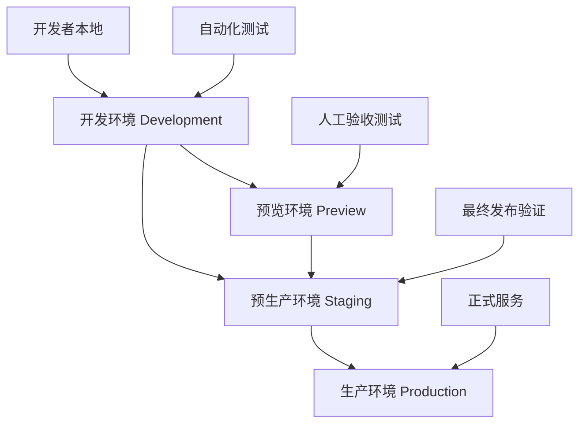
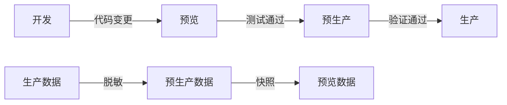
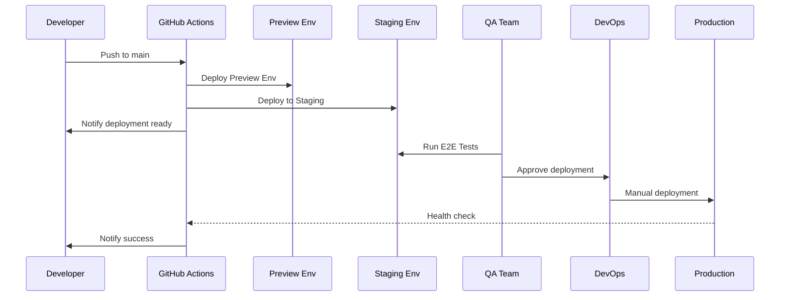

# Spydon 环境管理策略

## 概述

Spydon 采用多层次的环境管理策略，确保从开发到生产的平稳过渡和高质量交付。

## 环境架构



## 环境详细配置

### 1. 开发环境 (Development)

**用途**: 开发者日常开发和自动化测试
- **触发条件**: 每次 push 到 `main`/`develop` 分支
- **数据源**: 测试数据、模拟服务
- **自动恢复**: 是
- **备份策略**: 不需要
- **监控级别**: 基础监控

**资源配置**:
```yaml
backend:
  replicas: 1
  resources:
    requests: { memory: "256Mi", cpu: "250m" }
    limits: { memory: "512Mi", cpu: "500m" }

frontend:
  replicas: 1
  resources:
    requests: { memory: "128Mi", cpu: "100m" }
    limits: { memory: "256Mi", cpu: "200m" }

database:
  replicas: 1
  storage: 10Gi
  resources:
    requests: { memory: "512Mi", cpu: "250m" }
```

**网络配置**:
- 命名空间: `spydon-development`
- 内部访问: ClusterIP
- 外部访问: Ingress (dev.spydon.local)

**CI/CD 集成**:
- 自动部署: ✅
- 自动测试: ✅
- 健康检查: ✅
- 回滚机制: ❌ (手动)

### 2. 预览环境 (Preview)

**用途**: Pull Request 代码审查和验收测试
- **触发条件**: PR 创建/更新
- **生命周期**: PR 合并后自动销毁
- **数据源**: 脱敏的生产数据快照
- **自动恢复: 否**
- **备份策略**: 不需要
- **监控级别**: 轻量监控

**资源配置**:
```yaml
backend:
  replicas: 1
  resources:
    requests: { memory: "256Mi", cpu: "250m" }
    limits: { memory: "512Mi", cpu: "500m" }

frontend:
  replicas: 1
  resources:
    requests: { memory: "128Mi", cpu: "100m" }
    limits: { memory: "256Mi", cpu: "200m" }

database:
  replicas: 1
  storage: 5Gi
  resources:
    requests: { memory: "256Mi", cpu: "100m" }
```

**环境隔离**:
- 命名空间: `preview-pr-{pr_number}`
- URL: `pr-{pr_number}.spydon-preview.local`
- 数据库: 独立实例
- 缓存: 独立 Redis 实例

**自动化流程**:
```yaml
创建:
  - PR 打开 → 创建预览环境
  - 部署最新代码
  - 发送通知到 PR

更新:
  - PR 更新 → 重新部署
  - 运行自动化测试
  - 更新环境状态

销毁:
  - PR 合并/关闭 → 清理环境
  - 删除所有资源
  - 发送清理完成通知
```

### 3. 预生产环境 (Staging)

**用途**: 生产发布前的最终验证
- **触发条件**: `main` 分支通过所有测试
- **数据源**: 生产数据镜像
- **自动恢复**: 是
- **备份策略**: 每日备份
- **监控级别**: 完整监控

**资源配置**:
```yaml
backend:
  replicas: 2
  resources:
    requests: { memory: "512Mi", cpu: "500m" }
    limits: { memory: "1Gi", cpu: "1000m" }

frontend:
  replicas: 2
  resources:
    requests: { memory: "256Mi", cpu: "200m" }
    limits: { memory: "512Mi", cpu: "400m" }

database:
  replicas: 1
  storage: 50Gi
  resources:
    requests: { memory: "1Gi", cpu: "500m" }
```

**高可用配置**:
- 负载均衡: 是
- 健康检查: 是
- 自动扩容: 是
- 故障转移: 是

**部署策略**:
- 蓝绿部署: 是
- 金丝雀发布: 可选
- 回滚机制: 自动
- 部署验证: 是

### 4. 生产环境 (Production)

**用途**: 正式商业服务
- **触发条件**: 手动发布审批
- **数据源**: 真实生产数据
- **自动恢复**: 是
- **备份策略**: 实时备份 + 每日全量
- **监控级别**: 全面监控 + 告警

**资源配置**:
```yaml
backend:
  replicas: 3
  resources:
    requests: { memory: "1Gi", cpu: "1000m" }
    limits: { memory: "2Gi", cpu: "2000m" }

frontend:
  replicas: 3
  resources:
    requests: { memory: "512Mi", cpu: "400m" }
    limits: { memory: "1Gi", cpu: "800m" }

database:
  replicas: 1 (with replicas)
  storage: 200Gi
  resources:
    requests: { memory: "2Gi", cpu: "1000m" }
```

**安全配置**:
- 网络隔离: 多层防火墙
- 访问控制: RBAC + SSO
- 数据加密: 传输 + 存储加密
- 审计日志: 完整记录

**运维策略**:
- 24/7 监控: ✅
- 自动告警: ✅
- 故障自愈: ✅
- 灾难恢复: ✅

## 环境间数据流



### 数据管理策略

1. **开发环境数据**:
   - 自动生成的测试数据
   - 模拟数据和 fixtures
   - 每日重置

2. **预览环境数据**:
   - 从预生产环境创建快照
   - 自动脱敏处理
   - 环境创建时初始化

3. **预生产环境数据**:
   - 从生产环境定期同步
   - 自动脱敏处理
   - 每日增量更新

4. **生产环境数据**:
   - 真实业务数据
   - 多地域备份
   - 实时同步

## 发布流程

### 自动化发布流程



### 发布策略矩阵

| 环境 | 自动部署 | 人工审批 | 回滚策略 | 监控要求 |
|------|----------|----------|----------|----------|
| Development | ✅ | ❌ | 手动 | 基础 |
| Preview | ✅ | ❌ | 自动 | 轻量 |
| Staging | ✅ | ❌ | 自动 | 完整 |
| Production | ❌ | ✅ | 自动 | 全面 |

## 配置管理

### 环境配置隔离

每个环境使用独立的配置文件和密钥：

```yaml
# environments/development/kustomization.yaml
apiVersion: kustomize.config.k8s.io/v1beta1
kind: Kustomization
configMapGenerator:
  - name: robusta-config
    literals:
      - ENVIRONMENT=development
      - LOG_LEVEL=debug
      - DATABASE_HOST=postgres-dev
      - REDIS_HOST=redis-dev

# environments/production/kustomization.yaml
apiVersion: kustomize.config.k8s.io/v1beta1
kind: Kustomization
configMapGenerator:
  - name: robusta-config
    literals:
      - ENVIRONMENT=production
      - LOG_LEVEL=info
      - DATABASE_HOST=postgres-prod
      - REDIS_HOST=redis-prod
```

### 密钥管理

- **开发环境**: 明文配置，本地密钥
- **预览环境**: 自动生成临时密钥
- **预生产环境**: 从密钥管理系统复制
- **生产环境**: 专用密钥，严格访问控制

## 监控和告警

### 监控级别

1. **开发环境**:
   - 基础资源监控
   - 简单健康检查
   - 邮件通知

2. **预览环境**:
   - 应用性能监控
   - 自动化测试结果
   - Slack 通知

3. **预生产环境**:
   - 完整 APM 监控
   - 用户体验监控
   - 多渠道告警

4. **生产环境**:
   - 全面监控覆盖
   - 实时告警
   - 自动故障响应

### 告警策略

| 环境 | CPU > 80% | 内存 > 85% | 磁盘 > 90% | 响应时间 > 2s |
|------|-----------|------------|------------|---------------|
| Development | 15分钟 | 15分钟 | 30分钟 | 不告警 |
| Preview | 10分钟 | 10分钟 | 20分钟 | 5分钟 |
| Staging | 5分钟 | 5分钟 | 10分钟 | 2分钟 |
| Production | 1分钟 | 1分钟 | 5分钟 | 30秒 |

## 成本优化

### 资源优化策略

1. **开发环境**:
   - 使用 Spot 实例
   - 非工作时间休眠
   - 共享资源池

2. **预览环境**:
   - 按需创建
   - 及时销毁
   - 最小资源配置

3. **预生产环境**:
   - 工作时间保持
   - 自动扩缩容
   - 资源复用

4. **生产环境**:
   - 预留实例
   - 高可用部署
   - 性能优化

### 预算分配

- 开发环境: 15%
- 预览环境: 10%
- 预生产环境: 25%
- 生产环境: 50%

## 应急响应

### 故障处理流程

1. **自动检测**: 监控系统自动发现问题
2. **自动响应**: 自动回滚或重启服务
3. **人工介入**: DevOps 团队处理复杂问题
4. **根因分析**: 事后分析和改进

### 应急联系人

| 环境 | 主要联系人 | 备用联系人 | 升级时间 |
|------|------------|------------|----------|
| Development | 开发团队 | DevOps | 2小时 |
| Preview | 开发团队 | DevOps | 1小时 |
| Staging | QA团队 | DevOps | 30分钟 |
| Production | DevOps | 管理层 | 5分钟 |

## 合规和审计

### 审计要求

1. **变更记录**: 所有环境变更完整记录
2. **访问日志**: 详细访问记录
3. **数据保护**: 符合数据保护法规
4. **安全扫描**: 定期安全漏洞扫描

### 合规检查

- **每日**: 自动化安全扫描
- **每周**: 配置合规检查
- **每月**: 完整审计报告
- **每季度**: 第三方安全评估

这个环境管理策略确保了 Spydon 平台的高质量交付和稳定运行。
